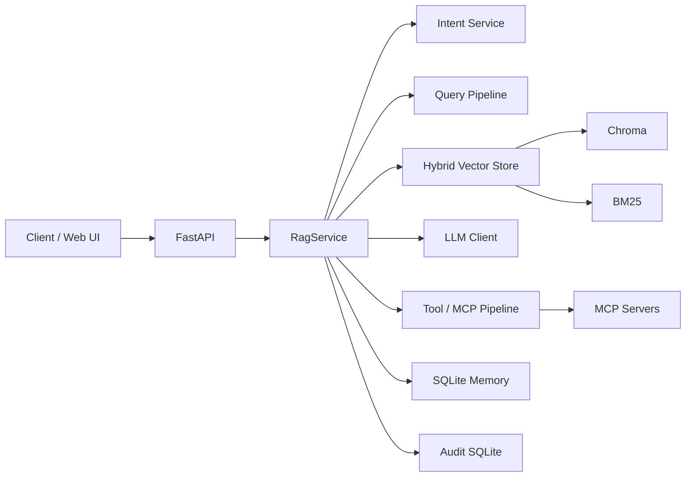

# Ragent

参考 LangGraph 构建的企业级知识助手。当前已支持 RAG 检索问答、意图识别 与 多工作流路由；下一阶段将演进为 Multi-Agent 协作架构，支撑工具调用与复杂任务编排。

[](https://www.python.org/)
[](https://fastapi.tiangolo.com/)
[](#license)

## 特性

- **三路意图分流**：`RAG`（知识检索问答）/ `CHAT`（闲聊）/ `AGENT`（工具调用）
- **混合检索**：Chroma 向量检索 + BM25（jieba 分词）融合，可选 Cross-Encoder 重排
- **流式输出**：`POST /api/chat/stream` 支持 SSE 增量推送
- **会话记忆**：SQLite 持久化，Cookie 绑定 `session_id`，刷新页面可恢复历史
- **MCP 工具目录**：读取 `config/mcp_servers.json`，合并本地工具与 MCP `list_tools`
- **可观测性**：按 `trace_id` 写入审计事件，支持时间线回放
- **内置 Web UI**：`static/` 提供开箱即用的聊天界面

## 架构概览



## 快速开始

### 环境要求

- Python 3.10+
- [Ollama](https://ollama.com/)（用于 embedding；若 LLM 也走 Ollama 则一并需要）
- Node.js / Docker（可选，仅在使用 MCP stdio 服务时需要）

### 1. 克隆并安装依赖

```bash
git clone https://github.com/YOUR_USERNAME/Ragent.git
cd Ragent

python -m venv .venv
# Windows
.\.venv\Scripts\Activate.ps1
# macOS / Linux
source .venv/bin/activate

pip install -r requirements.txt
```

### 2. 配置环境变量

在项目根目录创建 `.env`：

```dotenv
# LLM（默认 provider=deepseek）
LLM_PROVIDER=deepseek
LLM_MODEL=deepseek-chat
DEEPSEEK_API_KEY=your_api_key_here
DEEPSEEK_BASE_URL=https://api.deepseek.com

# 向量库
CHROMA_PERSIST_DIR=knowledge/chroma
CHROMA_COLLECTION=huawei_voicecall_faq

# Ollama（embedding / 可选生成）
OLLAMA_BASE_URL=http://localhost:11434
OLLAMA_EMBED_MODEL=nomic-embed-text:latest

# 审计（默认开启）
RAGENT_AUDIT_ENABLED=true

# CORS（可选；默认允许 localhost / 127.0.0.1 任意端口）
# RAGENT_CORS_ORIGINS=http://localhost:3000,http://127.0.0.1:5173

# MCP（可选；默认读取 config/mcp_servers.json）
# RAGENT_MCP_CONFIG=config/mcp_servers.json
```

> `.env` 已在 `.gitignore` 中，请勿提交密钥。

### 3. 灌入示例知识库（可选）

仓库自带华为语音通话 FAQ 示例数据：

```bash
python scripts/ingest_chunks_to_chroma.py \
  knowledge/HUAWEI-Voicecall-faq.chunks.jsonl \
  --persist-dir knowledge/chroma \
  --collection huawei_voicecall_faq
```

### 4. 启动服务

```bash
uvicorn app.main:app --reload --host 127.0.0.1 --port 8001
```

- **Web UI**：http://127.0.0.1:8001
- **OpenAPI 文档**：http://127.0.0.1:8001/docs

Windows 下可用脚本快速冒烟：

```powershell
.\scripts\call_chat_debug.ps1 -BaseUrl "http://127.0.0.1:8001"
```

## API 参考

所有 JSON 接口外层统一封装为：

```json
{
  "code": "OK",
  "message": "success",
  "data": {}
}
```

| 方法 | 路径 | 说明 |
|------|------|------|
| `POST` | `/api/chat` | 非流式问答 |
| `POST` | `/api/chat/stream` | SSE 流式问答 |
| `GET` | `/api/chat/history` | 从 Cookie 恢复会话历史 |
| `GET` | `/api/tools/catalog` | 本地工具 + MCP 工具目录 |

### `POST /api/chat`

**请求体**

| 字段 | 类型 | 说明 |
|------|------|------|
| `query` | string | 用户问题 |
| `session_id` | string? | 会话 ID；不传则服务端创建 |
| `history` | `{role, content}[]` | 历史消息 |
| `top_k` | int | RAG 检索条数，默认 5 |
| `debug` | bool | 为 true 时在 `meta` 返回调试信息 |

**响应 `data` 关键字段**

| 字段 | 说明 |
|------|------|
| `intent` | `RAG` / `CHAT` / `AGENT` |
| `answer` | 回答文本 |
| `sources` | 引用文档 ID 列表 |
| `trace_id` | 请求追踪 ID |
| `session_id` | 服务端会话 ID |

**示例**

```bash
curl -X POST http://127.0.0.1:8001/api/chat \
  -H "Content-Type: application/json; charset=utf-8" \
  -d '{"query": "华为语音通话如何开通？", "top_k": 5}'
```

### `POST /api/chat/stream`

返回 `text/event-stream`，事件类型：

- `meta` — 会话元信息（如 `session_id`）
- `delta` — 增量文本 `{ "type": "delta", "content": "..." }`
- `done` — 结束 `{ "type": "done" }`

> 浏览器端请用 `fetch` + `ReadableStream` 解析，不能用 `EventSource`（仅支持 GET）。

### `GET /api/tools/catalog`

返回合并后的工具列表，包含 MCP 加载状态与错误信息，便于自检。

## 配置说明

| 变量 | 默认值 | 说明 |
|------|--------|------|
| `LLM_PROVIDER` | `deepseek` | `openai` / `deepseek` / `ollama` |
| `LLM_MODEL` | `deepseek-chat` | 模型名称 |
| `CHROMA_PERSIST_DIR` | — | Chroma 持久化目录 |
| `CHROMA_COLLECTION` | — | 集合名称 |
| `RAG_VECTOR_DISABLED` | — | 设为 `1`/`true` 禁用向量检索 |
| `RAGENT_MCP_CONFIG` | `config/mcp_servers.json` | MCP 配置文件路径 |
| `RAGENT_AUDIT_ENABLED` | `true` | 审计开关 |
| `RAGENT_CORS_ORIGINS` | — | 逗号分隔的允许源；不设则用 localhost 正则 |

更多 LLM / 重排 / 混合检索参数见 `app/infra/llm/config.py` 与 `app/infra/vector_store_search/`。

## 项目结构

```
Ragent/
├── app/
│   ├── main.py              # FastAPI 入口
│   ├── api/                 # HTTP 路由
│   ├── services/            # 编排服务（RagService 等）
│   ├── pipeline/            # 意图分流、Query、Tool 流水线
│   ├── infra/               # LLM、向量库、MCP、审计、记忆库
│   ├── domain/              # Schema 与枚举
│   └── framework/           # 中间件、统一响应、SSE
├── config/
│   └── mcp_servers.json     # MCP 服务配置
├── scripts/                 # 灌库、探测、排障脚本
├── knowledge/               # 示例知识库与 Chroma 数据
├── static/                  # 内置 Web UI
├── data/                    # 运行期 SQLite（gitignore）
├── tests/
└── requirements.txt
```

## 常用脚本

```bash
# MCP 探测：列出工具并可选 call_tool
python scripts/mcp_probe.py --config config/mcp_servers.json --server filesystem

# 审计回放（按 trace_id）
python scripts/dump_audit_trace.py <trace_id>

# FAQ 灌入 Chroma
python scripts/ingest_chunks_to_chroma.py <chunks.jsonl> \
  --persist-dir knowledge/chroma --collection huawei_voicecall_faq
```

## 开发与测试

```bash
# 运行测试
pytest tests/

# 启动冒烟（需先启动服务）
python tests/manual/startup_smoke.py
```

### 设计约定

- **审计与业务解耦**：意图识别、工具调用等业务函数不直接写审计；审计通过管道层 `emit_event` 统一采集
- **Prompt 集中管理**：不在业务代码中拼接长 prompt，统一放在 `app/infra/llm/prompts.py`
- **开发阶段少做静默回退**：问题应暴露而非被隐藏，便于定位

## 前端联调提示

1. **CORS**：默认允许 `http://localhost:*` 与 `http://127.0.0.1:*`；生产环境请通过 `RAGENT_CORS_ORIGINS` 显式配置
2. **Session**：服务端通过 `HttpOnly` Cookie（`rag_session_id`）维护会话；跨域时需 `credentials: "include"`
3. **代理**：也可在前端 dev server 将 `/api` 代理到 `http://127.0.0.1:8001`

## License

MIT（如需调整许可证，请替换本节并在仓库根目录添加 `LICENSE` 文件。）
